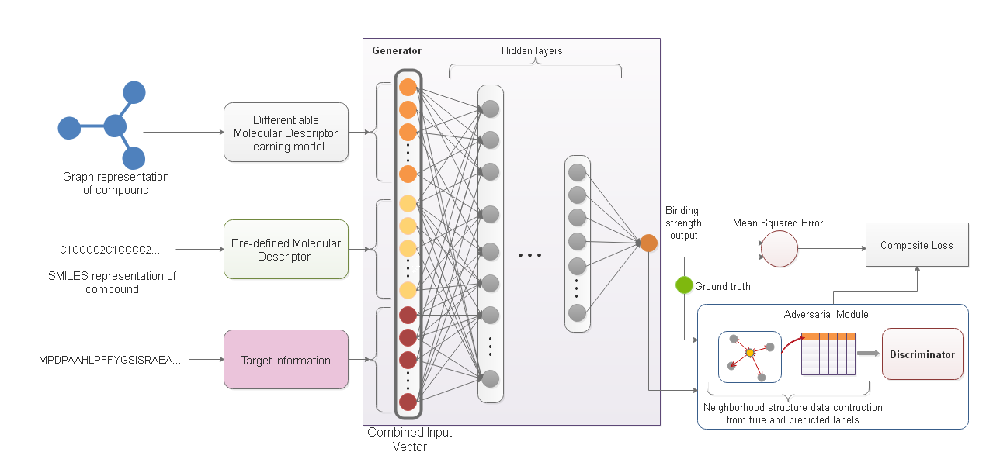

# Drug-Target Indication Prediction by Integrating End-to-End Learning and Fingerprints
Computer-Aided Drug Discovery research has proven to be a promising direction in drug discovery. In recent years, Deep Learning approaches have been applied to problems in the domain such as Drug-Target Indication Prediction and have shown improvements over traditional screening methods. 

An existing challenge is how to represent compound-target pairs in deep learning models. While several representation methods exist, such descriptor schemes tend to complement one another in many instances, as reported in the literature. 
In this project, we propose a multi-view architecture trained adversarially to leverage this complementary behavior for DTI prediction by integrating both differentiable and predefined molecular descriptors (fingerprints). Our results on empirical data demonstrate that our approach, generally, results in improved model accuracy.

This repository contains the accompanying codes and other ancillary files of the aforementioned study.



# Requirements
| Project/Module | Version                                  |
|----------------|------------------------------------------|
| Pytorch        | >=1.1.0                                  |
| Numpy          | >=1.15                                   |
| DeepChem       |  >= 2.2.0                                      |
| Padme          | [See the PADME project](https://github.com/simonfqy/PADME) |
| Pandas         |  >= 0.25.0                                        |
| Seaborn        |  0.9.0                                        |
| Soek           |  [See the Soek project](https://github.com/bbrighttaer/soek)                                        |
> **Note:** The `dcCustom` package of the [PADME project](https://github.com/simonfqy/PADME) has been refactored to have the new package name `padme` in this project and should not be misunderstood with any other module which may be bearing the same name. We took this decision in order to enhance clarity in our work by calling it the name given to it by its authors.

# Usage
The bash files found [here](./proj/dti) are used for model training and evaluation of the baseline and the IVPGAN models.
The bash files with the `padme_` prefix train the baseline models reflected in their name. 
For instance, `padme_cold_drug_gconv_cv_kiba` trains our implementation of the `GraphConv-PSC` model using k-fold
Cross-Validation with a cold drug splitting scheme on the KIBA dataset. The IVPGAN models are trained using
the bash files with the `integrated_` prefix. They also follow the same naming pattern as the `padme_` files.

The bash file with `_eval_` in their names are used for evaluating a trained model. We use a resource tree
structure to aggregate all training and evaluation statistics which are then saved
 as JSON files for later analysis. For more on the resource tree structure, you can examine 
 [sim_data.py](./ivpgan/utils/sim_data.py) and its usage in [singleview.py](./proj/dti/singleview.py) and
 [train_joint_gan.py](./proj/dti/train_joint_gan.py). The performance data saved in a JSON file of 
 each evaluated model is analysed using [worker.py](proj/dti/analysis/worker.py). The data that generates the reported results can be found [here](proj/dti/analysis/).

# Results

## Quantitative results

<table>
<thead>
	<tr>
		<th colspan=5>RMSE</th>
	</tr>
</thead>
<tbody>
	<tr>
		<td><b>Dataset</b></td>
		<td><b>CV split type</b></td>
		<td><b>ECFP8</b></td>
		<td><b>GraphConv</b></td>
		<td><b>IVGPAN</b></td>
	</tr>
	<tr>
		<td rowspan=3>Davis</td>
		<td>Warm</td>
		<td>0.2216 &plusmn; 0.082</td>
		<td>0.3537 &plusmn; 0.053</td>
		<td><b>0.2014</b>&plusmn; 0.043</td>
	</tr>
	<tr>
		<td>Cold drug</td>
		<td>0.3978 &plusmn; 0.105</td>
		<td>0.4751 &plusmn; 0.123</td>
		<td><b>0.2895</b> &plusmn; 0.163</td>
	</tr>
	<tr>
		<td>Cold target</td>
		<td>0.5517 &plusmn; 0.088</td>
		<td>0.5752 &plusmn; 0.101</td>
		<td><b>0.2202</b>&plusmn; 0.139</td>
	</tr>
	<tr>
		<td rowspan=3>Metz</td>
		<td>Warm</td>
		<td><b>0.3321</b>&plusmn; 0.057</td>
		<td>0.5537 &plusmn; 0.033</td>
		<td>0.5529 &plusmn; 0.033</td>
	</tr>
	<tr>
		<td>Cold drug</td>
		<td><b>0.3778</b>&plusmn; 0.097</td>
		<td>0.5711&plusmn; 0.057</td>
		<td>0.5477 &plusmn; 0.064</td>
	</tr>
	<tr>
		<td>Cold target</td>
		<td>0.6998 &plusmn; 0.065</td>
		<td>0.7398 &plusmn; 0.047</td>
		<td><b>0.5745</b> &plusmn; 0.054</td>
	</tr>
	<tr>
		<td rowspan=3>KIBA</td>
		<td>Warm</td>
		<td>0.4350 &plusmn; 0.086</td>
		<td>0.5604 &plusmn; 0.120</td>
		<td><b>0.4003</b> 0.082</td>
	</tr>
	<tr>
		<td>Cold drug</td>
		<td><b>0.4502</b> &plusmn; 0.128</td>
		<td>0.552 &plusmn; 0.156</td>
		<td>0.4690 &plusmn; 0.132</td>
	</tr>
	<tr>
		<td>Cold target</td>
		<td>0.6645 &plusmn; 0.137</td>
		<td>0.7555 &plusmn; 0.153</td>
		<td><b>0.4486</b>&plusmn; 0.106</td>
	</tr>
</tbody>
</table>

<table>
<thead>
	<tr>
		<th colspan=5>Concordance Index</th>
	</tr>
</thead>
<tbody>
	<tr>
		<td><b>Dataset</b></td>
		<td><b>CV split type</b></td>
		<td><b>ECFP8</b></td>
		<td><b>GraphConv</b></td>
		<td><b>IVGPAN</b></td>
	</tr>
	<tr>
		<td rowspan=3>Davis</td>
		<td>Warm</td>
		<td>0.9647 &plusmn; 0.020</td>
		<td>0.9335 &plusmn; 0.011</td>
		<td><b>0.9729</b>&plusmn; 0.008</td>
	</tr>
	<tr>
		<td>Cold drug</td>
		<td>0.9099 &plusmn; 0.049</td>
		<td>0.8784 &plusmn; 0.052</td>
		<td><b>0.9493</b> &plusmn; 0.044</td>
	</tr>
	<tr>
		<td>Cold target</td>
		<td>0.8683 &plusmn; 0.033</td>
		<td>0.8480 &plusmn; 0.038</td>
		<td><b>0.9631</b>&plusmn; 0.036</td>
	</tr>
	<tr>
		<td rowspan=3>Metz</td>
		<td>Warm</td>
		<td><b>0.8983</b>&plusmn; 0.0.033</td>
		<td>0.7968 &plusmn; 0.027</td>
		<td>0.7913 &plusmn; 0.029</td>
	</tr>
	<tr>
		<td>Cold drug</td>
		<td><b>0.8730</b>&plusmn; 0.044</td>
		<td>0.7850&plusmn; 0.040</td>
		<td>0.7894 &plusmn; 0.042</td>
	</tr>
	<tr>
		<td>Cold target</td>
		<td>0.7304 &plusmn; 0.039</td>
		<td>0.7084 &plusmn; 0.041</td>
		<td><b>0.7776</b> &plusmn; 0.038</td>
	</tr>
	<tr>
		<td rowspan=3>KIBA</td>
		<td>Warm</td>
		<td>0.8322 &plusmn; 0.024</td>
		<td>0.7873 &plusmn; 0.029</td>
		<td><b>0.8433</b> 0.023</td>
	</tr>
	<tr>
		<td>Cold drug</td>
		<td><b>0.8132</b> &plusmn; 0.047</td>
		<td>0.7736 &plusmn; 0.048</td>
		<td>0.8070 &plusmn; 0.051</td>
	</tr>
	<tr>
		<td>Cold target</td>
		<td>0.7185 &plusmn; 0.044</td>
		<td>0.6661 &plusmn; 0.052</td>
		<td><b>0.8234</b>&plusmn; 0.044</td>
	</tr>
</tbody>
</table>

<table>
<thead>
	<tr>
		<th colspan=5>R<sup>2<sup/></th>
	</tr>
</thead>
<tbody>
	<tr>
		<td><b>Dataset</b></td>
		<td><b>CV split type</b></td>
		<td><b>ECFP8</b></td>
		<td><b>GraphConv</b></td>
		<td><b>IVGPAN</b></td>
	</tr>
	<tr>
		<td rowspan=3>Davis</td>
		<td>Warm</td>
		<td>0.9252 &plusmn; 0.061</td>
		<td>0.8254 &plusmn; 0.039</td>
		<td><b>0.9449</b>&plusmn; 0.021</td>
	</tr>
	<tr>
		<td>Cold drug</td>
		<td>0.7573 &plusmn; 0.171</td>
		<td>0.6773 &plusmn; 0.159</td>
		<td><b>0.8635</b> &plusmn; 0.151</td>
	</tr>
	<tr>
		<td>Cold target</td>
		<td>0.5916 &plusmn; 0.120</td>
		<td>0.5423 &plusmn; 0.121</td>
		<td><b>0.9059</b>&plusmn; 0.121</td>
	</tr>
	<tr>
		<td rowspan=3>Metz</td>
		<td>Warm</td>
		<td><b>0.8637</b>&plusmn; 0.057</td>
		<td>0.6279 &plusmn; 0.075</td>
		<td>0.6285 &plusmn; 0.078</td>
	</tr>
	<tr>
		<td>Cold drug</td>
		<td><b>0.8124</b>&plusmn; 0.117</td>
		<td>0.5860&plusmn; 0.120</td>
		<td>0.6166 &plusmn; 0.120</td>
	</tr>
	<tr>
		<td>Cold target</td>
		<td>0.4259 &plusmn; 0.121</td>
		<td>0.3619 &plusmn; 0.112</td>
		<td><b>0.5931</b> &plusmn; 0.106</td>
	</tr>
	<tr>
		<td rowspan=3>KIBA</td>
		<td>Warm</td>
		<td>0.7212 &plusmn; 0.072</td>
		<td>0.5513 &plusmn; 0.097</td>
		<td><b>0.7658</b> 0.065</td>
	</tr>
	<tr>
		<td>Cold drug</td>
		<td><b>0.6677</b> &plusmn; 0.137</td>
		<td>0.5026 &plusmn; 0.152</td>
		<td>0.6475 &plusmn; 0.142</td>
	</tr>
	<tr>
		<td>Cold target</td>
		<td>0.3648 &plusmn; 0.128</td>
		<td>0.1910 &plusmn; 0.088</td>
		<td><b>0.7056</b>&plusmn; 0.113</td>
	</tr>
</tbody>
</table>

## Qualitative results
- First two charts are for ECFP-PSC
- Second two charts are for GraphConv-PSC
- Last two charts are for IVPGAN

### Davis

#### Warm split
<p>


</p>

#### Cold drug split
<p>


</p>

#### Cold target split
<p>


<p/>

# Credits
We would like to acknowledge the authors of the PADME project for their work. Our project uses the data loading and metric procedures published by their work and we're grateful. We also acknowledge the authors and contributors of the DeepChem project for their works on Graph Convolution, Weave, and other featurization schemes; the `GraphConv` and `Weave` implementations are basically our Pytorch translations of their initial implementations.

# Cite
```bibitem
@inproceedings{Agyemang2019,
author = {Agyemang, Brighter and Wei-Ping, Wu and Kpiebaareh, Michael Y. and Nanor, Ebenezer},
title = {Drug-Target Indication Prediction by Integrating End-to-End Learning and Fingerprints},
year = {2019}
}
```
