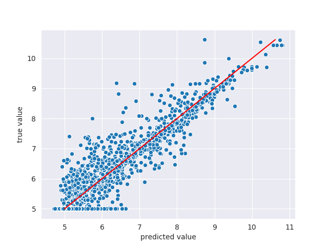

# Drug-Target Indication Prediction by Integrating End-to-End Learning and Fingerprints
Computer-Aided Drug Discovery research has proven to be a promising direction in drug discovery. In recent years, Deep Learning approaches have been applied to problems in the domain such as Drug-Target Indication Prediction and have shown improvements over traditional screening methods. 

An existing challenge is how to represent compound-target pairs in deep learning models. While several representation methods exist, such descriptor schemes tend to complement one another in many instances, as reported in the literature. 
In this project, we propose a multi-view architecture trained adversarially to leverage this complementary behavior for DTI prediction by integrating both differentiable and predefined molecular descriptors (fingerprints). Our results on empirical data demonstrate that our approach, generally, results in improved model accuracy.

This repository contains the accompanying codes and other ancillary files of the aforementioned study.

# Requirements
| Project/Module | Version                                  |
|----------------|------------------------------------------|
| Pytorch        | >=1.1.0                                  |
| Numpy          | >=1.15                                   |
| DeepChem       |  >= 2.2.0                                      |
| Padme          | [See the PADME project](https://github.com/simonfqy/PADME) |
| Pandas         |  >= 0.25.0                                        |
| Seaborn        |  0.9.0                                        |
| Soek           |  [See the Soek project](https://github.com/bbrighttaer/soek)                                        |
> **Note:** The `dcCustom` package of the [PADME project](https://github.com/simonfqy/PADME) has been refactored to have the new package name `padme` in this project and should not be misunderstood with any other module which may be bearing the same name. We took this decision in order to enhance clarity in our work by calling it the name given to it by its authors.

# Experiments

## Quantitative results

<table>
<thead>
	<tr>
		<th colspan=5>RMSE</th>
	</tr>
</thead>
<tbody>
	<tr>
		<td><b>Dataset</b></td>
		<td><b>CV split type</b></td>
		<td><b>ECFP8</b></td>
		<td><b>GraphConv</b></td>
		<td><b>IVGPAN</b></td>
	</tr>
	<tr>
		<td rowspan=3>Davis</td>
		<td>Warm</td>
		<td>0.2216 &plusmn; 0.082</td>
		<td>0.3537 &plusmn; 0.053</td>
		<td><b>0.2014</b>&plusmn; 0.043</td>
	</tr>
	<tr>
		<td>Cold drug</td>
		<td>0.3978 &plusmn; 0.105</td>
		<td>0.4751 &plusmn; 0.123</td>
		<td><b>0.2895</b> &plusmn; 0.163</td>
	</tr>
	<tr>
		<td>Cold target</td>
		<td>0.5517 &plusmn; 0.088</td>
		<td>0.5752 &plusmn; 0.101</td>
		<td><b>0.2202</b>&plusmn; 0.139</td>
	</tr>
	<tr>
		<td rowspan=3>Metz</td>
		<td>Warm</td>
		<td><b>0.3321</b>&plusmn; 0.057</td>
		<td>0.5537 &plusmn; 0.033</td>
		<td>0.5529 &plusmn; 0.033</td>
	</tr>
	<tr>
		<td>Cold drug</td>
		<td><b>0.3778</b>&plusmn; 0.097</td>
		<td>0.5711&plusmn; 0.057</td>
		<td>0.5477 &plusmn; 0.064</td>
	</tr>
	<tr>
		<td>Cold target</td>
		<td>0.6998 &plusmn; 0.065</td>
		<td>0.7398 &plusmn; 0.047</td>
		<td><b>0.5745</b> &plusmn; 0.054</td>
	</tr>
	<tr>
		<td rowspan=3>KIBA</td>
		<td>Warm</td>
		<td>0.4350 &plusmn; 0.086</td>
		<td>0.5604 &plusmn; 0.120</td>
		<td><b>0.4003</b> 0.082</td>
	</tr>
	<tr>
		<td>Cold drug</td>
		<td><b>0.4502</b> &plusmn; 0.128</td>
		<td>0.552 &plusmn; 0.156</td>
		<td>0.4690 &plusmn; 0.132</td>
	</tr>
	<tr>
		<td>Cold target</td>
		<td>0.6645 &plusmn; 0.137</td>
		<td>0.7555 &plusmn; 0.153</td>
		<td><b>0.4486</b>&plusmn; 0.106</td>
	</tr>
</tbody>
</table>

<table>
<thead>
	<tr>
		<th colspan=5>Concordance Index</th>
	</tr>
</thead>
<tbody>
	<tr>
		<td><b>Dataset</b></td>
		<td><b>CV split type</b></td>
		<td><b>ECFP8</b></td>
		<td><b>GraphConv</b></td>
		<td><b>IVGPAN</b></td>
	</tr>
	<tr>
		<td rowspan=3>Davis</td>
		<td>Warm</td>
		<td>0.2216 &plusmn; 0.082</td>
		<td>0.3537 &plusmn; 0.053</td>
		<td><b>0.2014</b>&plusmn; 0.043</td>
	</tr>
	<tr>
		<td>Cold drug</td>
		<td>0.3978 &plusmn; 0.105</td>
		<td>0.4751 &plusmn; 0.123</td>
		<td><b>0.2895</b> &plusmn; 0.163</td>
	</tr>
	<tr>
		<td>Cold target</td>
		<td>0.5517 &plusmn; 0.088</td>
		<td>0.5752 &plusmn; 0.101</td>
		<td><b>0.2202</b>&plusmn; 0.139</td>
	</tr>
	<tr>
		<td rowspan=3>Metz</td>
		<td>Warm</td>
		<td><b>0.3321</b>&plusmn; 0.057</td>
		<td>0.5537 &plusmn; 0.033</td>
		<td>0.5529 &plusmn; 0.033</td>
	</tr>
	<tr>
		<td>Cold drug</td>
		<td><b>0.3778</b>&plusmn; 0.097</td>
		<td>0.5711&plusmn; 0.057</td>
		<td>0.5477 &plusmn; 0.064</td>
	</tr>
	<tr>
		<td>Cold target</td>
		<td>0.6998 &plusmn; 0.065</td>
		<td>0.7398 &plusmn; 0.047</td>
		<td><b>0.5745</b> &plusmn; 0.054</td>
	</tr>
	<tr>
		<td rowspan=3>KIBA</td>
		<td>Warm</td>
		<td>0.4350 &plusmn; 0.086</td>
		<td>0.5604 &plusmn; 0.120</td>
		<td><b>0.4003</b> 0.082</td>
	</tr>
	<tr>
		<td>Cold drug</td>
		<td><b>0.4502</b> &plusmn; 0.128</td>
		<td>0.552 &plusmn; 0.156</td>
		<td>0.4690 &plusmn; 0.132</td>
	</tr>
	<tr>
		<td>Cold target</td>
		<td>0.6645 &plusmn; 0.137</td>
		<td>0.7555 &plusmn; 0.153</td>
		<td><b>0.4486</b>&plusmn; 0.106</td>
	</tr>
</tbody>
</table>

<table>
<thead>
	<tr>
		<th colspan=5>R2</th>
	</tr>
</thead>
<tbody>
	<tr>
		<td><b>Dataset</b></td>
		<td><b>CV split type</b></td>
		<td><b>ECFP8</b></td>
		<td><b>GraphConv</b></td>
		<td><b>IVGPAN</b></td>
	</tr>
	<tr>
		<td rowspan=3>Davis</td>
		<td>Warm</td>
		<td>0.2216 &plusmn; 0.082</td>
		<td>0.3537 &plusmn; 0.053</td>
		<td><b>0.2014</b>&plusmn; 0.043</td>
	</tr>
	<tr>
		<td>Cold drug</td>
		<td>0.3978 &plusmn; 0.105</td>
		<td>0.4751 &plusmn; 0.123</td>
		<td><b>0.2895</b> &plusmn; 0.163</td>
	</tr>
	<tr>
		<td>Cold target</td>
		<td>0.5517 &plusmn; 0.088</td>
		<td>0.5752 &plusmn; 0.101</td>
		<td><b>0.2202</b>&plusmn; 0.139</td>
	</tr>
	<tr>
		<td rowspan=3>Metz</td>
		<td>Warm</td>
		<td><b>0.3321</b>&plusmn; 0.057</td>
		<td>0.5537 &plusmn; 0.033</td>
		<td>0.5529 &plusmn; 0.033</td>
	</tr>
	<tr>
		<td>Cold drug</td>
		<td><b>0.3778</b>&plusmn; 0.097</td>
		<td>0.5711&plusmn; 0.057</td>
		<td>0.5477 &plusmn; 0.064</td>
	</tr>
	<tr>
		<td>Cold target</td>
		<td>0.6998 &plusmn; 0.065</td>
		<td>0.7398 &plusmn; 0.047</td>
		<td><b>0.5745</b> &plusmn; 0.054</td>
	</tr>
	<tr>
		<td rowspan=3>KIBA</td>
		<td>Warm</td>
		<td>0.4350 &plusmn; 0.086</td>
		<td>0.5604 &plusmn; 0.120</td>
		<td><b>0.4003</b> 0.082</td>
	</tr>
	<tr>
		<td>Cold drug</td>
		<td><b>0.4502</b> &plusmn; 0.128</td>
		<td>0.552 &plusmn; 0.156</td>
		<td>0.4690 &plusmn; 0.132</td>
	</tr>
	<tr>
		<td>Cold target</td>
		<td>0.6645 &plusmn; 0.137</td>
		<td>0.7555 &plusmn; 0.153</td>
		<td><b>0.4486</b>&plusmn; 0.106</td>
	</tr>
</tbody>
</table>

## Qualitative results

### Davis

#### Warm split

    <!-- ecfp -->
  

    
  

  

    
  

    <!-- graphconv -->
  

    
  

  

    
  

  
    <!-- ivpgan -->
  

    
  

  

    
  

#### Cold drug split

    <!-- ecfp -->
  

    
  

  

    
  

    <!-- graphconv -->
  

    
  

  

    
  

  
    <!-- ivpgan -->
  

    
  

  

    
  

#### Cold target split

    <!-- ecfp -->
  

    
  

  

    
  

    <!-- graphconv -->
  

    
  

  

    
  

  
    <!-- ivpgan -->
  

    
  

  

    
  

# Credits

# Cite